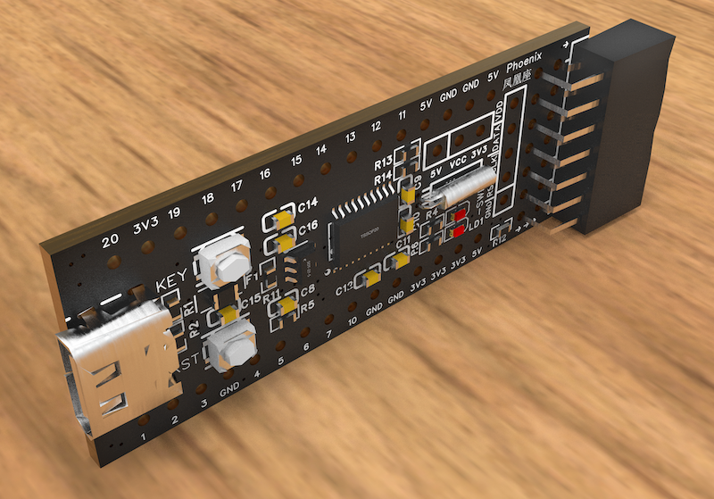
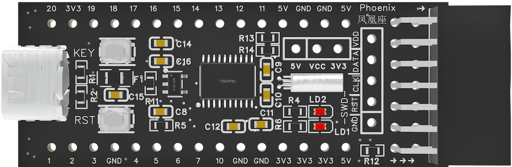
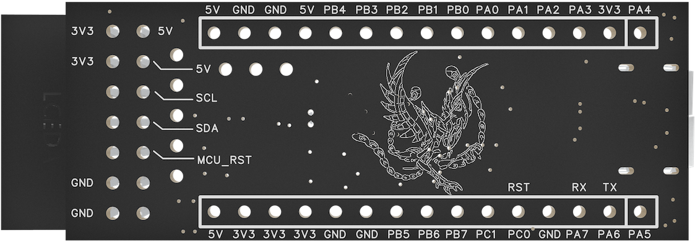

[中文](https://github.com/WeCanSTU/Phoenix/blob/main/README_CN.md) / [English](https://github.com/WeCanSTU/Phoenix/blob/main/README.md)

# Phoenix Core Board

## Product Overview

The Phoenix Core Board is a high-performance, low-power MCU core board designed based on the [PY32F002B microcontroller](https://py32.org/en/mcu/PY32F002Bxx.html). This core board features a 32-bit ARM Cortex-M0+ core with a main frequency up to 24MHz, and it provides 24KB of Flash memory and 3KB of SRAM, making it suitable for a wide range of embedded applications. It combines a compact hardware design, rich interface resources, and flexible expansion capabilities to offer a comprehensive solution for developers.

## Key Features
Below is the schematic diagram illustrating the core functionality of the board, providing a detailed view of the circuit design:

- **Processor**: 32-bit ARM Cortex-M0+ core, operating at 24MHz.
- **Memory Resources**: 24KB Flash and 3KB SRAM to meet storage needs in embedded development.
- **Low Power Design**: Supports low power modes like sleep and stop, suitable for battery-powered devices.
- **Rich Peripherals**:
  - 12-bit ADC: 8 external channels for various signal acquisition needs.
  - Timers: Advanced 16-bit timers (supporting PWM), low power timers.
  - Communication Interfaces: Support for SPI, USART, I2C, and more protocols.

## Hardware Board Design Highlights

- **Power and Indicators**:
  - Status Indicator (LD1): Controlled by chip PA5, customizable for user-defined functions (e.g., operation status, error indication).
  - Power Indicator (LD2): Displays the power status of the core board in real-time.
- **Button Features**:
  - Custom Button (KEY): Connected to the PA4 pin, allowing users to implement extended functions.
  - Reset Button (RST): Supports manual reset of the core board.
- **Expansion Interfaces**:
  - Type-C Interface: Supports 5V standalone power supply, complying with general Type-C power standards, providing convenient power for the board.
  - 20-Pin Header Interface: Standardized design offering abundant GPIO, power, and communication pins, facilitating peripheral expansion and system integration.
  - I2C Interface: Specifically designed for interfacing with the AriesPlus board, supporting rapid prototyping of DFU (Device Firmware Update) and CDC (Communication Device Class) functions.
  - SWD Debug Interface: Provides online debugging and firmware programming capabilities, convenient for development and testing.

## Front and Back Design Features

### Front Design

- Integrated PY32F002B chip and its peripheral circuits.
- Standard header interface providing comprehensive GPIO and communication resources.
- LD1 and LD2 indicators offer intuitive feedback on operation and power status.

### Back Design

- An elegant phoenix pattern symbolizing innovation and efficiency.
- Clear pin labels covering power, GPIO, and reset pins.

## Application Scenarios

- **Embedded Learning and Prototyping**: Simple and user-friendly design helps developers get started quickly.
- **Industrial Control**: Offers high reliability and flexible expansion capabilities.
- **Portable Devices**: Type-C standalone power supply and low power design suit portable applications.
- **Product Development and Verification**: In conjunction with the AriesPlus board, it enables rapid DFU and CDC functionality verification.

## Conclusion

The Phoenix Core Board, with its high performance, low power consumption, Type-C standalone power supply support, and versatile interface design, provides embedded developers with a powerful development platform. Whether for learning, development, or commercial applications, it facilitates rapid innovation.

## Resources and Support

- **Forum**: [Phoenix Forum](https://forum.umetav.cn/t/phoenix)
  - **Operating Hours**: Daily from 8:00 AM to 1:00 AM Beijing Time.
  
- **QQ Group**: 786239575

- **Technical Support Email**: [tech@umetav.cn](mailto:tech@umetav.cn)

Feel free to contact us through these channels for more information or technical support regarding Phoenix Core Board.

