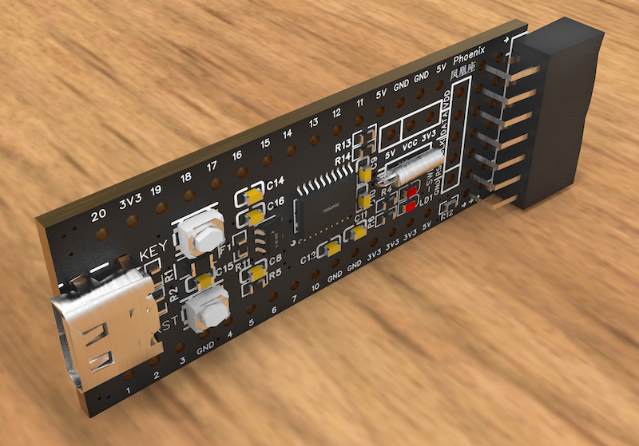
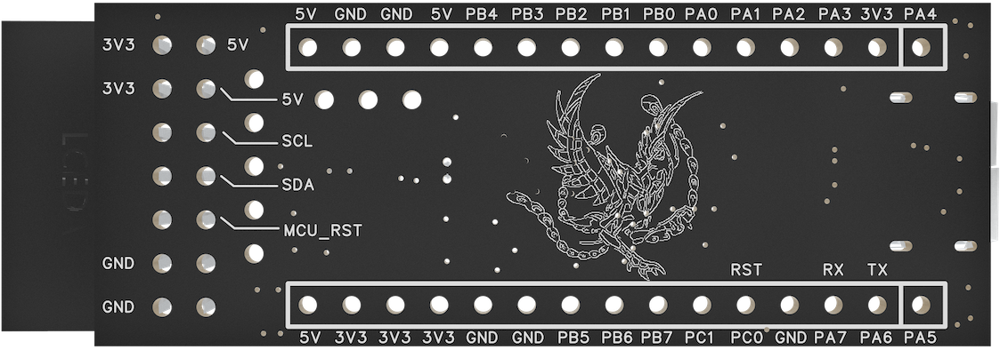

[中文](https://github.com/WeCanSTU/Phoenix/blob/main/README_CN.md) / [English](https://github.com/WeCanSTU/Phoenix/blob/main/README.md)

# Phoenix 凤凰座 MCU核心板

## 产品简介

Phoenix 凤凰座是一款基于[PY32F002B微控制器](https://py32.org/mcu/PY32F002Bxx.html)设计的高性能、低功耗MCU核心板。该核心板采用32位ARM Cortex-M0+内核，主频高达24MHz，提供24KB Flash和3KB SRAM存储，适合多种嵌入式应用场景。它结合紧凑的硬件设计、丰富的接口资源和灵活的扩展能力，为开发者提供一站式解决方案。

## 核心特性

- **处理器**: 32位ARM Cortex-M0+内核，主频24MHz。
- **存储资源**: 24KB Flash和3KB SRAM，满足嵌入式开发的存储需求。
- **低功耗设计**: 支持休眠和停止等低功耗模式，适合电池供电设备。
- **丰富外设**:
  - 12位ADC：8个外部通道，适用于多种信号采集需求。
  - 定时器：高级16位定时器（支持PWM）、低功耗定时器。
  - 通信接口：支持SPI、USART、I2C等多种协议。

## 硬件板设计亮点
以下是展示核心板功能的电路设计图，提供电路设计的详细视图：

- **电源与指示灯**:
  - 状态指示灯（LD1）: 由芯片PA5控制，可用于用户自定义功能（如运行状态、错误指示等）。
  - 电源指示灯（LD2）: 实时显示核心板供电状态。
- **按键功能**:
  - 自定义按键（KEY）: 连接至PA4引脚，便于用户实现功能扩展。
  - 复位按键（RST）: 支持手动复位核心板。
- **扩展接口**:
  - Type-C接口: 支持5V独立供电，符合通用Type-C供电标准，为核心板提供便捷的运行电源。
  - 20针排针接口: 标准化设计，提供丰富的GPIO、电源和通信引脚，便于外设扩展和系统集成。
  - I2C接口: 专为与AriesPlus板对接设计，支持快速实现DFU（设备固件更新）和CDC（通信设备类）功能原型开发。
  - SWD调试接口: 提供在线调试和固件烧录能力，方便开发和测试。

## 正反面功能解析

### 正面设计

- 集成PY32F002B芯片及其外围电路。
- 标准排针接口，提供全面的GPIO和通信资源。
- LD1和LD2指示灯直观反馈运行和供电状态。

### 背面设计

- 精美的凤凰图案象征创新与效率。
- 引脚标注清晰，涵盖电源、GPIO和复位引脚。

## 应用场景

- **嵌入式学习与原型开发**: 简单易用的设计，帮助开发者快速上手。
- **工业控制**: 提供高可靠性和灵活扩展能力。
- **便携设备**: Type-C独立供电和低功耗设计适合便携应用。
- **产品开发与验证**: 与AriesPlus板配合，快速实现DFU和CDC功能验证。

## 总结

Phoenix 凤凰座核心板以其高性能、低功耗、Type-C独立供电支持和灵活接口设计，为嵌入式开发者提供了一个强大的开发平台。无论是学习、开发还是商业应用，它都能助您快速实现创新。

## 资源与支持

- **论坛**: [Phoenix凤凰座](https://forum.umetav.cn/t/phoenix)
  - **开放时间**: 北京时间每日早上8点到凌晨1点。
  
- **QQ群**: 786239575

- **技术支持邮箱**: [tech@umetav.cn](mailto:tech@umetav.cn)

请随时通过这些渠道联系我们，获取关于 Phoenix凤凰座核心板 的更多信息或技术支持。